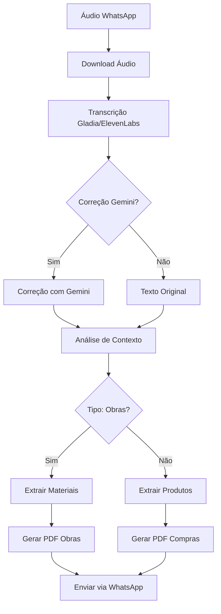

# Bot de Orçamento - WhatsApp

Bot inteligente para WhatsApp que processa áudios de pedreiros e gera orçamentos de materiais de construção automaticamente.

## 🚀 Funcionalidades

- **Transcrição de Áudio**: Suporte para ElevenLabs e Gladia
- **Correção Inteligente**: Usa Google Gemini para corrigir e melhorar transcrições
- **Análise Contextual**: Detecta automaticamente se é sobre obras ou compras
- **Extração de Materiais**: Identifica materiais de construção e quantidades
- **Geração de PDF**: Cria orçamentos profissionais em PDF
- **Envio Automático**: Envia o PDF de volta via WhatsApp

## 📋 Pré-requisitos

- Python 3.8+
- Conta no WhatsApp Business API
- Chaves de API dos serviços utilizados

## 🛠️ Instalação

1. Clone o repositório:
```bash
git clone <url-do-repositorio>
cd bot_orcamento
```

2. Instale as dependências:
```bash
pip install -r requirements.txt
```

3. Configure as variáveis de ambiente:
```bash
cp env_example.txt .env
# Edite o arquivo .env com suas chaves de API
```

## ⚙️ Configuração

### Variáveis de Ambiente Necessárias

```env
# WhatsApp Business API
VERIFY_TOKEN=seu_token_de_verificacao
META_WA_TOKEN=seu_token_whatsapp_business
WA_PHONE_NUMBER_ID=seu_phone_number_id

# Serviços de Transcrição (escolha um)
ELEVENLABS_API_KEY=sua_chave_elevenlabs
GLADIA_API_KEY=sua_chave_gladia
TRANSCRIPTION_SERVICE=gladia  # ou elevenlabs

# Google Gemini (para correção de transcrição)
GEMINI_API_KEY=sua_chave_gemini
ENABLE_GEMINI_CORRECTION=true

# Contexto de Análise
ANALYSIS_CONTEXT=obras  # ou compras

# Twilio (para envio de mensagens)
TWILIO_ACCOUNT_SID=seu_account_sid
TWILIO_AUTH_TOKEN=seu_auth_token
TWILIO_FROM_NUMBER=seu_numero_twilio

# Supabase (para armazenamento de PDFs)
SUPABASE_URL=sua_url_supabase
SUPABASE_KEY=sua_chave_supabase
SUPABASE_BUCKET_NAME=pdf-files
```

## 🚀 Como Executar

1. **Inicie o ngrok** (para expor localmente):
```bash
ngrok http 8000
```

2. **Configure o webhook** no WhatsApp Business API com a URL do ngrok

3. **Inicie o projeto**:
```bash
python -m uvicorn app.main:app --host 0.0.0.0 --port 8000 --reload
```

## 🧪 Testando a Integração

Execute o script de teste para verificar se tudo está funcionando:

```bash
python test_gemini_integration.py
```

## 📝 Exemplo de Uso

### Áudio de Pedreiro:
> "Preciso de 10 sacos de cimento, 500 tijolos, 20 metros de madeira, 5 rolos de fio elétrico e 2 torneiras para a reforma da casa"

### Processamento:
1. **Transcrição**: Áudio → Texto (Gladia/ElevenLabs)
2. **Correção**: Texto → Texto melhorado (Gemini)
3. **Análise**: Detecção de contexto (obras/compras)
4. **Extração**: Materiais e quantidades identificados
5. **PDF**: Orçamento gerado automaticamente
6. **Envio**: PDF enviado de volta via WhatsApp

## 🔧 Configurações Avançadas

### Habilitar/Desabilitar Correção com Gemini
```env
ENABLE_GEMINI_CORRECTION=true  # ou false
```

### Escolher Serviço de Transcrição
```env
TRANSCRIPTION_SERVICE=gladia  # ou elevenlabs
```

### Definir Contexto de Análise
```env
ANALYSIS_CONTEXT=obras  # ou compras
```

## 📊 Fluxo de Processamento



## 🐛 Solução de Problemas

### Erro de API Key
- Verifique se todas as chaves estão configuradas no arquivo `.env`
- Teste a conectividade com: `python test_gemini_integration.py`

### Problemas de Transcrição
- Verifique se o áudio está em formato suportado (.ogg)
- Teste com diferentes serviços (Gladia vs ElevenLabs)

### Falha no Envio
- Verifique configurações do Twilio
- Confirme se o número está no formato correto

## 📈 Melhorias Futuras

- [ ] Suporte a mais idiomas
- [ ] Integração com sistemas de estoque
- [ ] Análise de preços de mercado
- [ ] Histórico de orçamentos
- [ ] Interface web para configuração

## 🤝 Contribuição

1. Fork o projeto
2. Crie uma branch para sua feature
3. Commit suas mudanças
4. Push para a branch
5. Abra um Pull Request

## 📄 Licença

Este projeto está sob a licença MIT. Veja o arquivo LICENSE para mais detalhes.